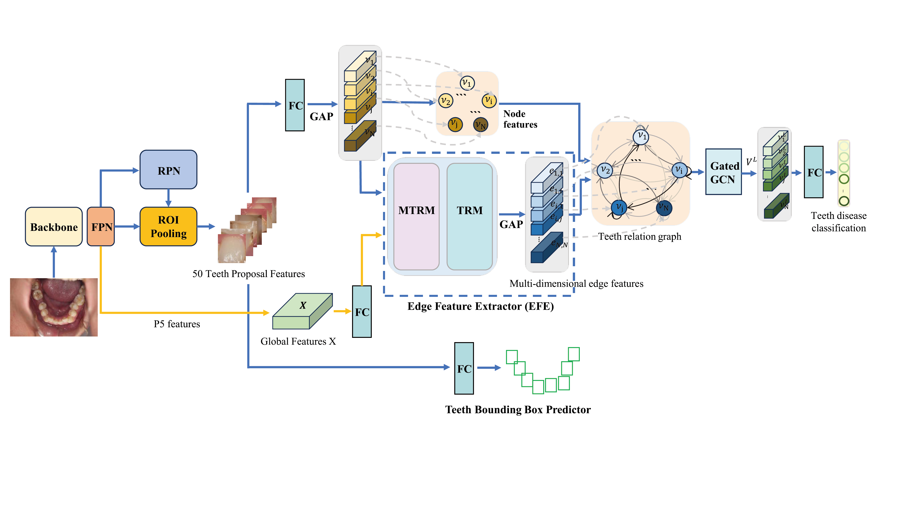

#    GraphTeeth


## Requirements

* Python 3.8
* PyTorch
* Check the required python packages in [requirements.txt](requirements.txt).
```
pip install -r requirements.txt
```

## Training and Testing

To train and test the GraphTeeth model, you can modify the required parameters in the [config/omni_config.yaml](config/omni_config.yaml) configuration file or pass them directly via the command line:

* Train:
```
python train.py --exp-name 'edge_resnet34' --arc 'resnet34' --gpu_ids '0'
```

* Test:

Modify the 'modelpath' variable and set it to the path of the trained model.
```
python test.py --exp-name 'edge_resnet34' --arc 'resnet34' --gpu_ids '0'
```
Modify the following code in the graphteeth.py file to switch between **using node features only** and **using multi-dimensional edge features** model.
```
from model.MEFL import MEFARG # use edge
# from model.MEFL_node import MEFARG # only node
```

## Model Zoo
| arch_type  | GoogleDrive link| mAP_50 |
|:--------------:|:--------------:|:--------------:|
| GraphTeethNet(Resnet-34)                      | [link](https://drive.google.com/file/d/1-uiBnExrpqStfKyYuFWxCnYpKO19QTeV/view?usp=drive_link)           | 63.89          |
| GraphTeethNet(Resnet-50)                      | [link](https://drive.google.com/file/d/12ufLFsRsr6noJSvMaalfXjqnv_8Kb-Vs/view?usp=drive_link)           | 61.42          |
| GraphTeethNet(Resnet-34) without edge features| [link](https://drive.google.com/file/d/1NYhzXAFyRxWQ0rrRtF9IoUFbJ82P6MaE/view?usp=drive_link)           | 62.09          |
