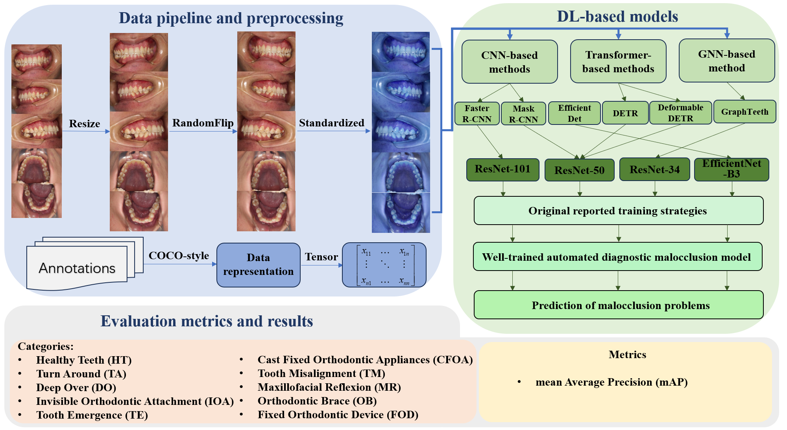

# Oral Imaging for Malocclusion Issues Assessments: OMNI Dataset, Deep Learning Baselines and Benchmarking
## Introduction
This is the official code repo of *Oral Imaging for Malocclusion Issues Identification: Dataset, Deep Learning Models and Benchmark*.

In this project, 6 deep learning models were reproduced and evaluated, including three CNN-based models, two Transformer-based models, and one GNN-based model. In addition, we use these 6 widely used deep learning models as benchmarks, which have never been applied to automated diagnosis of malocclusion before. For a detailed description, please refer to our paper.

All benchmarked models are evaluated on: the OMNI Dataset.


## Dataset
The datasets we used for benchmark are [OMNI Dataset](https://drive.google.com/file/d/1eSyipRJTDlAbRs0yb44l5vQjVYibRXy1/view?usp=drive_link).

* OMNI includes 4166 RGB images of the oral cavity captured by a standard RGB camera, which are recorded from multiple views, including frontal occlusal, left occlusal, right occlusal, maxillary craniofacial, and mandibular craniofacial. All images are labeled with multiple malocclusion issues by professional dentists.
* OMNI dataset consists of 4166 RGB dental images collected from a total of 384 Chinese participants, including 153 males and 231 females. The age distribution of these participants ranged from 3-48 years old, with a mean age of 10.4 years old and a standard deviation of 5.63.
* OMNI dataset captured images of involved 903 frontal occlusal photographs, 841 left occlusal photographs, 843 right occlusal photographs, 820 maxillary maxillofacial photographs, and 759 mandibular maxillofacial photographs. We may continue to expand this dataset in the future.
```
OMNI Dataset
    ├── annotations                  Loading data in COCO format and category-wise 
    │   ├── instances_test.json 
    │   ├── instances_train.json
    │   ├── instances_val.json
    ├── test                         Test set Image (828)
    ├── train                        Train set Image (2481)
    ├── val                          val set Image (857)
```

* The dataset is placed under data/OMNI_COCO.

## Training and Testing
Please refer to the README.md files within each model for detailed information.

## Citation
Please kindly cite our papers if you used or were inspired by our idea:
```
@article{xue2025oral,
  title={Oral Imaging for Malocclusion Issues Assessments: OMNI Dataset, Deep Learning Baselines and Benchmarking},
  author={Xue, Pujun and Ge, Junyi and Jiang, Xiaotong and Song, Siyang and Wu, Zijian and Huo, Yupeng and Xie, Weicheng and Shen, Linlin and Zhou, Xiaoqin and Liu, Xiaofeng and others},
  journal={arXiv preprint arXiv:2505.15637},
  year={2025}
}
```
